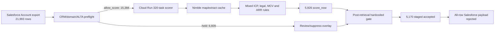
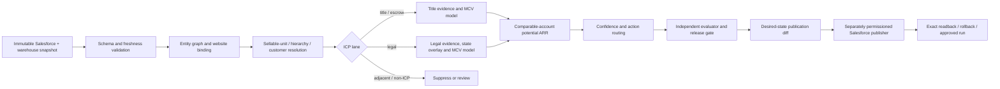

# CertifID Account Scoring Architecture Review

Date: 2026-07-10
Status: architecture recommendation; no implementation authorization
Scope: Account identity, website binding, sellable-account resolution, ICP lanes, MCV, pipeline-potential ARR, evaluation, Salesforce publication, and production runtime

## Executive verdict

**Retain the product idea and the operating surfaces; refactor the system architecture; replace the unsafe decision and publication components.**

The current system should not be discarded and rewritten from zero. It already has valuable assets: a dedicated Cloud Run/GCS runtime, a complete cached extraction for the latest full run, Salesforce AI scoring fields, ALTA and registry evidence, a legal-lane prototype, customer-history features, run manifests, and useful audit scripts. Those assets shorten the path materially.

The present scorer is nevertheless not a coherent production decision system. It is a sequence of partially overlapping gates in which the scored unit is implicit, sources are sometimes used outside their authority, examples have become production branches, and value calculation can occur before entity eligibility is established. The rejected post-retrieval gate does not repair those problems: it default-accepts residual `score_now` rows and stages an unsafe Salesforce payload.

The recommended architecture is a layered, fail-closed pipeline:

1. immutable source snapshot and schema validation;
2. legal-entity and website binding;
3. sellable-account, hierarchy, duplicate, and customer resolution;
4. lane-specific ICP classification;
5. structured evidence extraction;
6. lane-specific MCV estimation;
7. comparable-account pipeline-potential ARR estimation;
8. confidence and action routing;
9. independent evaluation and approval;
10. desired-state Salesforce publication with exact backup, readback, and rollback.

The canonical economic unit is **the independently sellable buying/contracting unit**, represented by one surviving Salesforce Account for publication. A Salesforce Account, legal entity, DBA, branch, and parent are not assumed to be the same thing.

The fastest safe route is a refactor around the cached July full-run evidence, not another full extraction and not an API-only patch. Consolidate the scorer source, build the entity/sellable-unit resolver, separate the title and legal lanes, recalibrate MCV and ARR on independent holdouts, rerun from cached evidence, and only then consider an accepted-only, no-clear Salesforce canary.

## Review basis and verified baseline

This review treated prior plans and audits as hypotheses, then checked load-bearing claims against the current code and local artifacts. No Salesforce write, metadata deploy, `Account.Website` update, GCP execution, or Nimble call was performed.

Verified full-run facts:

- The Salesforce snapshot contains 21,993 unique Accounts.
- Preflight allowed 15,384 Accounts and held 6,609.
- Cloud Run completed 320 of 320 tasks and produced 15,384 unique output IDs with no missing, unexpected, or duplicate IDs.
- The scorer produced 5,926 `score_now`, 2,796 `manual_review`, 5,426 `insufficient_public_evidence`, 1,187 `non_icp_confirmed`, and 49 `hygiene_review` rows.
- The scorer's structural audit passed, but Salesforce readiness failed.
- There were 1,336 CRM `Law firm` Accounts in `score_now`; 750 had bypassed the legal lane because `Company_Type__c` was not present in scorer input.
- The rejected post-retrieval gate reduced `score_now` to 5,170, but the population still included wrong entities, adjacent businesses, and non-net-new lifecycle states.

Independent code/data findings materially relevant to the design:

- `build_icp_quality_preflight_crm.py` starts with `scoreable_icp`/`allow_score` and only changes the result when a branch fires. It does not establish a general Account-to-website binding before allowing extraction (`scripts/icp_quality_agent/build_icp_quality_preflight_crm.py`, especially lines 299-319 and 378-449).
- The scoring-input builder omits `Company_Type__c`, `Type`, parent context, and the detailed quality provenance. It also converts blank website hygiene to `confirmed` (`scripts/icp_quality_agent/build_icp_quality_preflight_crm.py`, lines 468-491).
- `load_alta()` creates a dictionary entry even for `ALTA_Member=false`, while `classify()` later tests only whether the dictionary is truthy. In the July overlay, 12,133 `ALTA_Member=false` rows were allowed with the reason “ALTA membership match plus no deterministic suppression signal.” Of those, 130 were outside the explicit title/law/escrow types, and 54 survived into the rejected 5,170 accepted set. This is a source-semantics bug, not merely a threshold issue (`scripts/icp_quality_agent/build_icp_quality_preflight_crm.py`, lines 252-276 and 431-449).
- The Cloud scorer's office counter counts distinct address-like context strings and location URL slugs, not verified operating offices. It produced 183 “offices” for `David M Levin -> flwaterfront.com`, 104 for `One Real Brokerage`, 55 for `Veritas Title -> achievacu.com`, and 36 for `SB. Titles -> yourstatebank.com`. These counts drove the highest MCV tier (`cloud_run_jobs/certifid_account_scoring/certifid_account_scoring/scoring/run_greenfield_nimble_test.py`, lines 514-538 and 846-904).
- Website quality is partly a count of pages, services, tools, and site richness. The MCV ladder then uses that value as capacity evidence. A sophisticated site can therefore raise volume even when it is not the entity's site or when sophistication is unrelated to closing throughput (same scorer, lines 634-647 and 846-904).
- The current MCV-to-ARR table is a static ladder. Several materially different MCV bands map to the same $150,000 point, including every band from 400 through 2,500 MCV (`run_greenfield_nimble_test.py`, lines 76-90). It is not a comparable-account estimator.
- The current `Score` is taken from the selected MCV band, even though the Salesforce plan defines it as the S1-S10 total. It is therefore a restatement of MCV, not an independent fit/capacity score (`run_greenfield_nimble_test.py`, lines 76-90 and 903-915; `docs/sfdc_account_value_scoring_build_plan.md`, line 464).
- Of the raw 5,926 scored rows, 1,485 had a positive Account MCV anchor and 4,441 did not. All 178 scored rows with failed retrieval had positive anchors. Anchors are useful, but the code can let them determine eligibility/value before entity and legal checks in several branches.
- The active anchor logic is strongly upward-biased. Among 825 `score_now` rows with Sales Rep MCV, 377 predictions equaled the anchor, 442 were above it, and only six were below it. Source recency is absent from the scorer input.
- The headline 59-row legal MCV backtest is not independent: 58 rows had a nonzero input MCV, 44 input values equaled the evaluation label, 33 predictions copied the input, and only one evaluation row was anchor-free. A reported low median error on that test primarily validates anchor reuse, not website-derived capacity (`scripts/backtest_account_value_predictions.py` and `artifacts/prospect_value_research/legal_law_firm_validation_2026-06-16_batch2/backtest_pre_anchor_guard_v3_20260617/`).
- Existing ARR calibration data mixes commercial motions: the account-level ARR labels include New Business and renewal rows, and the builder selects the latest per Account rather than a clean new-logo, pricing-normalized outcome. The current ladder is therefore not implementing the documented comparable-account method (`scripts/build_account_value_calibration_dataset.py`).
- The customer-history feature families are valuable, but the present SQL uses `CURRENT_DATE` windows and maximum historical outcomes rather than point-in-time features. It cannot be used unchanged in historical backtests (`scripts/account_scoring_customer_history_feature_pull.sql`).
- The rejected 5,170 accepted rows still included 238 `Churned Customer` status Accounts, three `1031 Exchange` company types, one CRM `Competitor`, one `Partner`, a college, a public adjuster, brokerages, lenders, and government/association examples. This confirms the failure generalizes beyond the named controls.
- `post_retrieval_quality_gate.py` uses named controls and short domain denylists inside production logic, reuses the same controls in acceptance tests, hardcodes `alta_sole_binding_proof` to zero, and default-accepts residual scorer `score_now` rows (`scripts/icp_quality_agent/post_retrieval_quality_gate.py`, lines 40-62, 113-157, and 198-211).
- The post-gate publisher stages all 21,993 Accounts, maps detailed quality states into lossy Salesforce picklists, emits blank numeric cells for non-accepted rows, forces held URL status to `not_run`, and reuses the raw scorer run ID. The existing orchestrator review correctly rejected the payload (`tmp/post_retrieval_quality_gate_20260710/orchestrator_review_2026-07-10.md`).
- The Cloud Run foundation is useful but not yet a durable orchestrator. Retry attempts write to the same task paths; manifests omit input/config/code hashes; cache identity excludes URL and extractor version; task sharding depends on input order and task count; and billed request/cache/retry counts are absent (`cloud_run_jobs/certifid_account_scoring/certifid_account_scoring/batch_job.py`).

These findings support one conclusion: the structural runner worked, but the business decision boundary did not.

## Current-state architecture

The important architectural properties are:

- identity, website hygiene, ICP, hierarchy, extraction, MCV, and publication logic are split across different scripts without one canonical decision contract;
- preflight and postflight are both incomplete safety boundaries;
- the scorer interleaves evidence retrieval, classification, anchor handling, capacity estimation, and final routing;
- local and Cloud copies of the scorer differ, so “the scorer” is not a single versioned component;
- evaluations use small, overlapping, and sometimes hand-tuned cohorts; and
- Salesforce has latest-value fields, but no approved-run boundary that makes one immutable run the reporting release.

## Root-cause assessment

### 1. The scored unit was never made explicit

The pipeline begins from a Salesforce Account row and tends to treat it as entity, website owner, office network, economic buyer, and publication unit simultaneously. That is false for duplicates, DBAs, branches, underwriter-owned operations, shared-domain families, child companies, past customers, and centrally contracted parents.

### 2. Source authority is not bounded

ALTA evidence is sometimes treated as if it validates a website. Account website content is sometimes treated as if it validates the Account identity. A CRM Company Type is sometimes ignored and sometimes used as a veto. Rep MCV can act as an eligibility bypass. Shared domain can act as customer/duplicate proof. Each source is individually useful, but only for specific decisions.

### 3. Safety logic is duplicated instead of composed

Preflight, scorer, overlay, post-gate, audit, and writeback each contain their own vocabularies and precedence. Fixes in one layer do not reliably propagate to the others. The law-firm omission is the clearest example: preflight knew Company Type, but the scorer input did not carry it.

### 4. Patches became fixtures and fixtures became rules

Named examples and a handful of domains entered production decision code, then the same examples were used to prove the code worked. This measures branch execution, not generalization.

### 5. Capacity proxies are not entity-safe

Office/staff/site-quality features are calculated before the system has proven that the content belongs to the entity and that the addresses are operating offices. The value model therefore amplifies entity-resolution errors.

### 6. Calibration and scoring anchors are entangled

Rep/BDR/Opportunity MCV is useful as a prior and a historical label, but the current backtests do not consistently hold it out from the predictor. That can make accuracy circular. Historical customer ARR is also a different construct from pipeline-potential ARR.

### 7. Publication lacks a desired-state transaction

The current process builds CSV rows rather than a versioned, approved desired state. It has no distinct candidate/canary/approved release lifecycle, no live-source fingerprint check, incomplete null semantics, and no exact compare-and-swap rollback guard.

## Retain, refactor, or replace

| Component or source | Verdict | Rationale and target treatment |
|---|---|---|
| Salesforce Account and Opportunity data | **Retain** | Keep Salesforce as canonical publication/reporting and the Account ID as publication key. Treat CRM fields as source assertions with timestamps, not proof of all entity facts. |
| Existing `AI_Prospect_*` Account fields | **Retain + extend** | Keep accepted-current-state fields and their pipeline-potential wording. Add an approved-run boundary and exact QA/sellable-entity provenance rather than repurposing operational MCV fields. |
| `build_icp_quality_preflight_crm.py` | **Refactor substantially** | Turn it into schema validation plus a canonical entity/sellable-unit resolver. Remove default allow, false-ALTA semantics, implicit hygiene confirmation, naive domain parsing, and customer/domain shortcuts. |
| `build_icp_quality_overlay_2k.py` | **Retain as historical regression evidence; retire as production boundary** | Its incidents and fixtures are valuable. Do not keep a second production classifier. |
| `post_retrieval_quality_gate.py` and current tests | **Replace** | The default-accept, hardcoded controls, circular tests, lossy payload, and all-row update model are unsafe. |
| Nimble map/extract cache and raw artifacts | **Retain** | Reuse the July cached evidence. Re-key by normalized URL + content/extractor version; add TTL, request accounting, and provenance. Nimble is evidence transport, not decision authority. |
| Local and Cloud `run_greenfield_nimble_test.py` | **Consolidate, then split** | Choose one package source. Separate extraction, feature derivation, lane classification, MCV, and ARR into modules with typed contracts. |
| Office/staff/site-quality extraction | **Replace office logic; refactor the rest** | Deduplicate normalized addresses, classify office versus partner/court/property/service-area evidence, preserve citations, and use site quality as evidence confidence rather than volume. |
| `legal_entity_scoring.py` | **Retain as a prototype; refactor** | Preserve state taxonomy and closing/general-practice evidence work. Make legal a separate lane with independent tests and calibration; remove unvalidated MCV floors and any anchor bypass. |
| Current title/escrow implicit classifier | **Replace with explicit lane classifier** | Distinguish title agent, escrow operator, abstract-only, underwriter, owned/direct, adjacent, and ambiguous. |
| Current MCV ladder/anchor rails | **Replace estimator; retain concepts** | Preserve MCV as the capacity construct and anchors as provenance-aware priors. Replace hand tiers with lane-specific calibrated quantiles. |
| Current static MCV-to-ARR ladder | **Replace** | Use versioned comparable-account distributions. Retain the definition “pipeline-potential ARR, not booked/forecast ARR.” |
| ALTA data | **Retain** | High-confidence membership/match can confirm entity/ICP. It cannot bind a website, prove capacity, or prove timing. Enforce membership and match-confidence semantics. |
| VA SCC, CA DFPI, bar/settlement and state sources | **Retain and adapterize** | Use as jurisdiction-scoped identity/licensing/eligibility evidence with source dates. Absence is not universal non-ICP proof. |
| Dedupe/hierarchy artifacts | **Retain as candidate evidence; refactor resolution** | ParentId and verified duplicate survivors are strong. Shared domain alone is not. Store relationship type, confidence, and effective date. |
| Customer-history feature pull | **Retain for calibration and routing** | Use current/retained/churned/usage/billing evidence for comparable selection, customer-quality labels, and customer/hierarchy resolution—not as greenfield prospect features. |
| `audit_crm_full_scoring_run.py` | **Retain and expand** | Its reconciliation is valuable. Add independent business controls, source-fingerprint checks, drift, lane metrics, and artifact hashes. |
| `build_greenfield_nimble_review_writeback.py` and post-gate payload builder | **Replace publication layer** | Build a desired-state diff, publish only changed IDs, separate review from hard clear, validate every field, and require live backup/readback. |
| Cloud Run Job + GCS | **Retain and refactor** | This is the shortest path. Add a run controller, immutable attempts, stage boundaries, hashes, budgets, metrics, and a separately permissioned publisher. |
| Fixed-run Salesforce reports | **Replace governance pattern** | Reports should show the latest Approved run plus `action=score_now`, not hardcode historical run IDs. |

## Recommended target architecture

Every stage emits a typed, versioned artifact. Later stages consume the artifact; they do not recompute earlier decisions. A failed or ambiguous earlier stage cannot be silently reversed by an MCV anchor.

Minimum canonical records:

- `Entity`: legal name, aliases/DBAs, jurisdiction, licenses, entity class, provenance.
- `WebsiteBinding`: canonical URL/domain, bound entity, decision, confidence, evidence citations, observed date, resolver version.
- `SellableUnit`: unit ID, surviving Salesforce Account ID, member entities/Accounts, parent unit, unit type, lifecycle/customer state, resolution confidence.
- `EvidenceSnapshot`: content hashes, source URLs, extracted structured facts, citations, provider/extractor versions.
- `ScoreCandidate`: lane, features, MCV quantiles, potential-ARR quantiles, confidence, action, all component versions.
- `PublicationPlan`: candidate run, desired operation, live-source fingerprint, before/after values, approval state.

## Canonical entity and hierarchy model

### Canonical unit

The unit scored is an **independently sellable unit**: the organization level at which CertifID can reasonably establish one commercial relationship, contract, budget, and value opportunity without double-counting another row.

It must have:

- one stable internal `SellableUnitId`;
- one surviving Salesforce Account ID for publication;
- a resolved entity/brand membership graph;
- one lifecycle lane (`net_new`, `winback`, `customer_expansion`, `partner`, or `excluded`);
- a website-binding state; and
- a lane-specific value eligibility decision.

### Treatment by record type

| Input concept | Canonical treatment |
|---|---|
| Salesforce Account | Publication and workflow record. It is a candidate member of a sellable unit, not automatically the unit itself. |
| Legal entity | Primary identity node. Multiple legal entities may form one centrally purchased unit; one entity may have several aliases. |
| DBA/brand | Alias of the entity/unit unless it has independent contracting/budget evidence. Do not score both alias and legal name. |
| Location/branch | Capacity evidence under a sellable unit. Score separately only with proof it is an independent buyer; a separate Salesforce row alone is insufficient. |
| Child company | Separate only when commercial ownership/budget/contracting is independent. Otherwise roll to the parent sellable unit. |
| Parent organization | Score at parent only when buying is centralized. Do not automatically roll independent subsidiaries merely because a parent relationship exists. |
| Underwriter corporate entity | Generally adjacent/non-net-new for this motion. Do not infer a direct agency opportunity from the corporate site. |
| Underwriter-owned direct operation | Route to owned/direct review. Score once only if the operating unit is independently sellable and its site/evidence is bound. |
| Duplicate Account | Select one survivor, link losers, and publish no standalone value to losers. |
| Existing active customer | Exclude from net-new TAM; route to customer/expansion analytics. |
| Churned/former customer | Route to a distinct winback lane. Do not count it in net-new prospect TAM. |
| Partner/vendor/competitor/1031/bank/lender/brokerage/government/education | Explicit adjacent/exclusion taxonomy. Do not allow title-like words on a page to convert the row into title ICP. |

Hierarchy aggregation occurs only after entity and relationship resolution. Child office counts may contribute to the surviving unit's capacity if they are verified operating locations and are not already represented on the parent's website evidence.

## Source-of-truth and evidence hierarchy

No source is globally authoritative. Authority is decision-specific.

| Source | Authoritative or strongest for | Not sufficient for | Required controls |
|---|---|---|---|
| Salesforce Account | Publication ID, current CRM assertions, owner/workflow, explicit ParentId, lifecycle flags | Legal identity, website ownership, capacity by itself | Snapshot timestamp/SystemModstamp, field provenance, conflict handling |
| Salesforce Opportunity | Historical selling motion, dated New Business MCV observations, booked contract/ARR context | Current website ownership; prospect potential; durable capacity if stale | Opportunity type/stage/date/pricing filters; account-time grain; renewal/expansion exclusion |
| Rep/BDR/AE MCV | Human observation/prior when source and observation date are known | Entity eligibility; independent evaluation label when also used as a feature | Source identity, observed date, staleness, outlier review, holdout mode |
| Customer ARR, retention, health, consumption | Comparable selection, realized-outcome labels, hierarchy/billing context, customer-quality calibration | Greenfield ICP or a direct prospect feature | As-of snapshots, product/pricing normalization, churn/billing exceptions, leakage audit |
| `Account.Website` | Candidate URL supplied by CRM | Proof that the site belongs to the Account | Independent binding decision; never mutate it from scoring |
| Nimble-extracted content | Reproducible snapshot of site evidence | Truth of identity, licensing, capacity, or final classification | URL/content hash, extraction date/version, citations, cache status |
| ALTA | High-confidence member/entity and title-industry corroboration | Website ownership, office count, closing volume, current timing | Require `ALTA_Member=true`, confidence threshold, name/state match and as-of date |
| State licensing registry | Jurisdiction-specific legal/licensed identity and status | Website ownership, national eligibility, capacity | Source adapter, exact jurisdiction, license/status date, negative-result semantics |
| State bar / attorney-settlement source | Attorney identity and, where available, settlement authorization | Firm closing dominance or volume | Firm-to-attorney link, state/county rules, current status, separate dominance evidence |
| Hierarchy/dedupe data | Verified duplicate/survivor and relationship candidates | Automatic merge based only on domain/name | Relationship type, evidence, confidence, human confirmation for medium cases |
| External enrichment | Candidate identity/location/size evidence | Final truth when it conflicts with primary sources | Provider/version/date, field-level provenance and conflict resolution |
| Salesforce activity/intent | Current timing overlay after identity is resolved | ICP fit or economic capacity | Confirmed Account match, event date, coverage and separate timing score |

Source conflicts do not get “averaged.” They produce a structured conflict and a deterministic precedence or review action.

## Deterministic-versus-model responsibility matrix

| Decision/task | Deterministic responsibility | Bounded model responsibility | Fallback |
|---|---|---|---|
| Source snapshot and schema | Required columns, types, counts, hashes, freshness, joins | None | Fail run |
| Domain/URL parsing | Public-suffix-aware canonicalization, redirects, generic-host classification | None | Review/unbound |
| High-confidence entity binding | Exact/alias name, registry IDs, same-domain ownership, address/contact consistency | Adjudicate only conflicting/ambiguous evidence | `binding_review`; never accept by default |
| Sellable-unit/hierarchy | Customer state, verified duplicate survivor, explicit relationship rules, aggregation | Explain ambiguous organizational relationships from bounded evidence | Ops review |
| ICP exclusions | Explicit CRM/lifecycle types and authoritative entity classes | Classify ambiguous site/entity descriptions | Adjacent review |
| Website evidence extraction | Exact addresses, links, source spans, dedupe, counts | Convert prose into structured candidate facts with citations | Missing/unknown fields |
| Title/legal lane | Clear deterministic source/rule cases | Ambiguous dominance, DBA, owned/direct, or mixed-practice adjudication | Lane review |
| MCV | Versioned feature transforms, calibrated estimator, quantiles, anchor blending | No free-form numeric estimate | Withhold or wide interval |
| Potential ARR | Comparable cohort, shrinkage, quantiles, pricing normalization | None for final value; optional comparable explanation | Withhold |
| Confidence/action | Calibration-backed thresholds and routing table | None | Review |
| Evaluation | Independent fixtures, metrics, drift, release gates | Optional error-cluster summaries only | Fail release |
| Salesforce publication | Describe validation, diff, backup, explicit nulls, idempotency, readback | None | No write/rollback |

Any model step must use cached, approved inputs; emit schema-constrained fields; cite evidence spans/URLs; include `supports`, `contradicts`, or `unknown`; record provider/model/prompt versions; and be repeatable at low temperature. It may not browse unseen sources, choose the final numeric score, update Salesforce, or turn ambiguity into `score_now`.

## Title/escrow lane design

The title/escrow lane should be a dedicated classifier and capacity model on top of the shared entity-quality infrastructure.

Eligibility requires:

1. bound entity/site or authoritative non-site evidence;
2. net-new sellable-unit status;
3. title/escrow/settlement operating evidence;
4. no overriding adjacent, customer, duplicate, underwriter, owned/direct, or hierarchy decision; and
5. sufficient capacity evidence for value scoring.

The classifier should distinguish at minimum:

- title insurance agent/title company;
- escrow/settlement operator;
- abstract/search-only provider;
- underwriter corporate entity;
- underwriter-owned/direct operation;
- mixed/affiliated entity;
- adjacent/non-ICP; and
- ambiguous review.

Title-lane capacity features include verified operating offices, role-qualified staff, service/closing operations, registry footprint, underwriter relationships, geographic coverage, relevant systems/process evidence, and dated CRM/Opportunity priors. Website polish is evidence reliability, not volume.

## Legal lane design

Title and legal should share entity binding, hierarchy, source adapters, evidence provenance, run control, and publication. They should **not** share one final classifier or one MCV model.

Every CRM `Law firm` enters the legal lane before value eligibility. Legal classification must distinguish:

- affiliated title/settlement operating entity;
- real-estate-closing-focused firm;
- real-estate practice with unclear closing dominance;
- broad/general practice;
- market/state review; and
- non-ICP/insufficient evidence.

Legal eligibility requires operational closing evidence, not merely `real estate`, `title insurance`, attorney suffixes, or an attorney-state rule. State/county overlays affect the prior and required evidence; they do not create an MCV floor by themselves. Bar membership proves attorney status, while settlement-agent/licensing sources can prove authorization. Neither proves closing volume.

Affiliated title entities should enter the title capacity model when they are distinct operating/sellable entities. A law firm that performs closings remains in the legal MCV model because staff roles, offices, service mix, and state rules have different relationships to closing capacity.

## MCV methodology

### Definition

MCV is the estimated monthly closing capacity/opportunity for the resolved sellable unit, not a count of pages, addresses, Account rows, or licensed jurisdictions.

### Feature construction

- Bind evidence to the entity before using it.
- Normalize and geocode/deduplicate addresses. Classify each as owned operating office, shared/partner office, service area, courthouse/government address, customer/property listing, or unknown.
- Deduplicate staff across pages and retain relevant role families.
- Separate operational closing evidence from generic real-estate or marketing language.
- Preserve `website_implied_mcv`, each dated CRM/Opportunity anchor, and `recommended_mcv` as different fields.
- Treat rep/BDR/AE anchors as reliability-weighted priors after eligibility. Never let an anchor establish ICP, website binding, or legal dominance.
- Use source age, conflict, and evidence coverage to widen intervals.

### Estimator

Use separate title and legal estimators that predict P10/P50/P90 (or an approved equivalent) on log MCV. A transparent monotonic ordinal/quantile model is preferable for the first production version; a more complex model is justified only if it materially improves blind holdouts.

Training labels should use dated closed New Business Opportunity MCV observations with account-time snapshots. Use multiple observations diagnostically rather than silently selecting the one that best fits. Evaluate greenfield performance with all MCV anchors removed from model input. When an anchor is present in production, combine it with the evidence estimate using versioned reliability weights learned from historical accuracy and staleness—not fixed 2x rails alone.

Always emit two distinct estimates when history exists:

- `ExternalCapacityMCV`: uses only evidence available for a genuine greenfield prospect; and
- `HistoryAssistedMCV`: combines external capacity with a dated, reliability-weighted human/Opportunity prior.

The recommended published MCV identifies which estimate was used and preserves the other for QA. Material disagreement, for example a pre-approved ratio threshold between the independent estimates, routes to review rather than using `max()`.

Missing evidence must produce `insufficient_evidence` or a wide interval, not a default 25/40/62/75 value. Extreme values require corroborated capacity and should not be created solely by location-page or address counts.

## Pipeline-potential ARR methodology

### Definition

Pipeline-potential ARR is the attainable annual revenue opportunity for a resolved sellable unit at a reasonable product/pricing adoption, conditional on capacity and comparable customers. It is **not** booked ARR, forecast ARR, probability-weighted pipeline, expected ACV, or current timing.

### Recommended output

- point: shrunk P75 attainable first-year potential, conditional on winning a standard new-logo deal;
- range: shrunk P50-P90, widened when comparables are sparse;
- optional P50 “typical comparable” diagnostic for calibration, not the primary potential field;
- separate timing/conversion score if later validated.

P75 is recommended because the existing field is explicitly potential rather than expected booked ARR. Mike must approve that percentile; if leadership wants a typical booked outcome, use a separate P50/expected field rather than silently changing the meaning. The approved choice must be in field help text and model version.

### Comparable cohort

Build an as-of, hierarchy-resolved cohort from new-business/per-file accounts. Normalize for:

- title versus legal lane;
- product/pricing era and product mix;
- MCV band/quantile;
- state/market regime;
- verified operating footprint;
- independent versus parent-billed unit; and
- contract type/exception status.

Use all clean new-logo wins for the primary distribution and a healthy-retained view as a diagnostic/comparable-quality dimension. Calibrating only on retained customers would create survivorship bias. Exclude or separately flag renewals, expansions, duplicates, churn/bad debt, failed joins, subsidized/exception pricing, and records whose labels were used to tune rules. The first-year ARR formula must be Finance-approved before calibration.

Use hierarchical shrinkage so sparse legal/state/MCV cells borrow from lane and overall priors. Publish comparable counts and interval width. Replace the current flat $150K ceiling and discrete lookup with versioned distributions. Booked ARR remains a sanity and calibration outcome, not a forced one-to-one target.

## Customer retention and consumption integration

Retention, health, subscription status, direct usage, billing-rollup usage, and billable consumption should **not change greenfield ICP fit directly**. Most prospects have no such data, and using post-sale outcomes as prospect inputs creates leakage and unfairly precise scores.

Use customer history in four bounded ways:

1. **Lifecycle/hierarchy:** exclude active customers from net-new, identify winbacks, and distinguish operating account usage from parent billing rollups.
2. **Comparable selection:** distinguish healthy retained, churned, at-risk, billing-exception, and inactive customer cohorts.
3. **Potential ARR calibration:** calibrate attainable and expected distributions without confusing them.
4. **Separate expected-customer-quality model:** later train a score using only features observable before sale, with retention/consumption as outcomes. Keep it separate from ICP and potential ARR.

The existing customer-history pull is useful: it covers 21,873 Accounts, with customer health on 2,098, active subscription revenue on 2,214, direct usage on 2,087, billing-rollup usage on 2,085, and opportunity history on 5,442. Those are substantial calibration assets, but sparse prospect features.

## Evaluation and backtesting framework

### Independent fixture design

- Store golden labels outside production decision config.
- Freeze a written labeling protocol and provenance.
- Split by resolved entity/domain family, not row, so branches and duplicate Accounts cannot cross train/test.
- Maintain a protected blind holdout that developers and rule authors cannot inspect during tuning.
- Snapshot all time-varying features as of the prediction date.

Required fixture sets:

1. entity-to-website bindings: correct, wrong, shared/generic host, directory, unrelated same-name, international lookalike;
2. sellable-unit/hierarchy: parent, independent subsidiary, DBA, branch, owned/direct, duplicate, active customer, churned/winback;
3. title/escrow ICP and adjacent negatives;
4. legal closing-focused, affiliated title, unclear practice, BigLaw/general practice, and state/county cases;
5. title customer backtest with all MCV anchors held out;
6. legal customer backtest with anchors held out;
7. potential-ARR comparable and time-based holdouts; and
8. novel population controls not represented in production rules.

### Metrics

Entity and routing:

- precision/recall by disposition and confidence;
- high-confidence website-binding precision;
- high-confidence `score_now` ICP precision;
- valid-green recall and review rate;
- customer/duplicate/child/underwriter standalone leak count; and
- confidence calibration/Brier or expected calibration error.

MCV:

- median absolute log error and MAE;
- exact and adjacent-band accuracy;
- P10-P90 interval coverage and width;
- rank correlation/top-quartile lift;
- error by lane, state, evidence quality, anchor source/age, and footprint; and
- office/staff extraction precision against human labels.

Potential ARR:

- comparable count and shrinkage level;
- interval coverage against as-of realized first-year outcomes;
- calibration by predicted band/decile;
- top-quartile realized-value lift;
- bias by lane, state, pricing era, and hierarchy; and
- explicit potential/booked ratios so the field is not mistaken for forecast.

Population/runtime:

- action, lane, confidence, MCV, ARR, and review-rate drift;
- top-100 manual audit plus stratified random accepted audit;
- source coverage/freshness and join failures;
- cache hit/miss, requests, retries, failure reasons, latency, and estimated cost; and
- exact ID/schema/version/hash reconciliation.

### Recommended release gates

Before a Salesforce canary:

- zero known or blind wrong-site, customer, duplicate, hierarchy, underwriter, and law-bypass controls retain value;
- high-confidence binding precision at least 98%, with the lower 95% confidence bound at least 95%;
- high-confidence `score_now` ICP precision at least 97%;
- valid-green recall and auto-resolution coverage meet precommitted lane/source-quality thresholds (recommended: >=90% recall on evidence-complete positives, >=70% auto-decision coverage for evidence-complete title/escrow, and >=50% for evidence-complete legal); review rate must remain below the corresponding precommitted ceiling;
- no fatal source-schema/defaulting errors;
- MCV materially outperforms anchor-only and office-only baselines on the blind holdout, with calibrated intervals and high-confidence error lower than medium/low;
- potential-ARR distributions pass agreed calibration/lift thresholds and carry the approved percentile definition;
- the full-universe resolver/decision shadow reconciles exactly, reusing cached evidence for the 15,384 extracted rows while the 6,609 preflight-held or otherwise missing/stale-evidence rows remain held/no-change, and passes drift/manual audits; and
- publication backup, null behavior, readback, and rollback pass in a non-production test.

The exact MCV/ARR numerical thresholds should be approved before tuning; they must not be selected after seeing the holdout.

## Salesforce publication contract

Salesforce remains the canonical reporting and latest-approved publication system. It should not be the crawler or the sole audit store.

One desired-state row per target Account must contain:

- Salesforce Account ID and source `SystemModstamp`/fingerprint;
- SellableUnitId/type and surviving Account mapping;
- website-binding decision/confidence/provenance;
- lane, value eligibility, detailed quality disposition, and action;
- MCV and potential-ARR quantiles/point when eligible;
- canonical scored URL without changing `Account.Website`;
- evidence hash and sanitized evidence;
- resolver, lane, feature, MCV, ARR, config, code/container, and run versions;
- candidate run ID and evaluation timestamp; and
- desired operation: `publish_value`, `route_review_metadata_only`, `hard_suppress`, or `no_change`.

Publication rules:

- publish only changed IDs, never the entire universe by default;
- re-read the live source fingerprint and current AI run before write; reject stale/conflicting rows;
- `route_review_metadata_only` does not clear numeric fields;
- hard clear occurs only for approved, high-confidence suppression and uses verified explicit null semantics such as the proven `#N/A` path;
- review/provisional values remain in the immutable artifact or a dedicated review object/fields, not active Sales value fields;
- validate type, updateability, nillability, length, precision, and picklists for every field;
- use a distinct post-gate/candidate/canary/full run ID;
- take an immutable exact-ID, all-AI-field backup and hash it before the write;
- canary payload uses the exact Salesforce schema; and
- read back every written/cleared field and assert `Account.Website` did not change.

Recommended additive governance metadata:

- `AI_Prospect_Value_Run__c` with Candidate/Canary/Approved/Failed/RolledBack state, manifest hash, approvers, counts, cost, and backup/rollback pointers;
- `Account.AI_Prospect_Value_Approved_Run__c`, a lookup to `AI_Prospect_Value_Run__c`, so native Account reports can select the approved release;
- exact QA disposition;
- SellableUnitId/type;
- input fingerprint; and
- evidence hash.

After the governance metadata is deployed, Sales reports should filter to `AI_Prospect_Value_Approved_Run__c`/Approved run state and `action=score_now`, not a hardcoded historical run ID. A first accepted-only canary may precede that metadata only through a private report filtered to its unique immutable canary Run ID; progressive rollout and scheduling require the Approved-run lookup. Raw Components JSON should be RevOps/admin-only; sanitized evidence can be Sales-readable.

### Existing AI field behavior

| Existing field family | First canary / incrementals | Long-term contract |
|---|---|---|
| MCV point/low/high | Publish for accepted eligible rows | External/history-assisted provenance in Components/QA metadata; calibrated intervals |
| ARR point/range | Publish only after the field description/help text matches the approved P75/P50-P90 definition | Comparable-based P75 and range; never booked/forecast ARR |
| Confidence picklist/action/ICP/evidence/version/run/source/date | Publish for accepted rows; report filters require action + unique canary Run ID | Latest Approved desired state |
| `AI_Prospect_Value_Score__c` | Do not populate or use in canary reports; leave existing value untouched under no-clear posture | Define a new independent score or formally deprecate and clear through a separate approved clear canary |
| `AI_Prospect_Fit_Score__c` | Do not populate/use until a non-circular fit definition is validated | Separate calibrated fit/eligibility score, if retained |
| `AI_Prospect_Timing_Score__c` | Do not populate/use | Separate validated timing model only |
| `AI_Prospect_Data_Confidence_Score__c` | Do not populate/use; use the calibrated confidence picklist | Publish only if numeric confidence is itself calibrated |
| `AI_Prospect_Value_Rank__c` | Do not populate/use in canary or nightly incrementals; sort reports by ARR point | Prefer deprecation. If retained, recompute and republish rank for the entire Approved eligible snapshot, explicitly removing rank from rows leaving that snapshot; never mix ranks across incremental runs |

The currently deployed ARR metadata describes a “ceiling.” A P75 point is not a ceiling. Before any P75 canary, update the field description/help text through a separately approved metadata change, or choose and document a point definition compatible with the existing contract.

## Production runtime recommendation

### Platform choice

Retain external compute on the existing dedicated GCP project and Cloud Run Jobs. Salesforce-native scraping/scoring is a poor fit for timeouts, retries, content caching, and model calls. Moving to Azure or another serverless platform is viable only if CertifID has a controlling enterprise standard; it provides no compensating value for this migration and would lengthen the safe path.

| Runtime option | Assessment | Decision |
|---|---|---|
| Salesforce Apex/Flow owns web extraction/scoring | Callout/runtime/retry/cache limits and weak artifact provenance | Reject for scoring; use Salesforce for requests, workflow, approval, and publication |
| Existing GCP Cloud Run Jobs + GCS | Proven on the full run, isolated project/bucket/secret, reusable cache/task model | **Recommended**, with staged orchestration and publisher separation |
| Azure Functions/Container Apps or other serverless | Technically capable, but requires re-platforming identities, artifacts, retry, and observability | Consider only if CertifID mandates Azure; not the shortest path |
| GitHub Actions/local scripts | Useful for development and bounded manual validation; weak production ownership/secrets/retry posture | Development only |
| Event-per-Account scraping | Fast freshness but expensive, noisy, and prone to duplicate/racing work | Reject as primary; accept a queued refresh request feeding batches |
| Scheduled incremental batch | Natural fit for source snapshots, dedupe, budgets, canaries, and reproducibility | **Primary operating mode** |

### Scheduling

- nightly incremental candidate build for Accounts whose name, website, type, status, parent, owner/segment, or relevant Opportunity/customer context changed;
- weekly cheap website/status and source-freshness preflight;
- scheduled evidence refresh by TTL/risk tier;
- periodic full **re-evaluation from cached evidence**; and
- full extraction only when URL/input/content staleness requires it.

Use a queue/refresh-request record for one-off rescoring. Do not trigger an immediate web crawl for every Salesforce event.

### Stage and identity isolation

1. read-only Salesforce/warehouse snapshot;
2. entity resolver;
3. evidence cache/extractor;
4. lane/value scorer;
5. independent evaluator;
6. publication-plan/diff builder;
7. Salesforce publisher; and
8. readback/rollback verifier.

The extractor/scorer identity has no Salesforce write permission. The publisher has no Nimble secret, no metadata deploy permission, and no `Account.Website` update access. Use a dedicated Salesforce integration identity restricted to the approved AI fields.

### Reproducibility and observability

Every run pins:

- source snapshot IDs, max SystemModstamp, row count, and hashes;
- schema, entity-resolver, lane, feature, MCV, ARR, and config versions;
- container image digest/commit and dependency/provider versions;
- task topology, attempt, and immutable artifact hashes;
- request/cache/retry/failure counts and budget;
- evaluation results and approval state; and
- publication/backup/readback/rollback pointers.

Retries write immutable `attempt-N` paths. A reducer promotes exactly one complete successful attempt per shard with object-generation preconditions. Required-column or join-coverage failures stop before vendor calls.

### Cost controls

- resolve lifecycle/entity eligibility before extraction;
- cache by normalized URL + input/content/extractor version;
- cap selected pages and requests by lane/risk;
- do not recrawl unchanged sites merely because the scoring model changed;
- record cache hits, requests, retries, bytes, duration, and billed units;
- enforce per-run and per-account budgets; and
- sample/manual-review low-confidence tail rather than repeatedly crawling it.

## Migration plan

1. Freeze broad Salesforce scoring writes/clears and declare the July accepted set non-publishable.
2. Approve canonical sellable-unit, lifecycle, legal-lane, potential-ARR, and release definitions.
3. Make the Cloud package the single source of scorer code; freeze a characterized legacy baseline.
4. Define typed source, entity, evidence, score, and publication contracts with fail-closed schema validation.
5. Build the entity/website/sellable-unit resolver using existing CRM, ALTA, dedupe, registry, and cached evidence.
6. Externalize fixtures and build protected blind holdouts before tuning.
7. Split title and legal lanes; fix office/staff/evidence features.
8. Calibrate lane-specific MCV and comparable potential ARR, holding anchors and post-sale features out appropriately.
9. Refactor Cloud Run into immutable stages and implement the desired-state publisher/readback/rollback package.
10. Run a 21,993-row resolver/decision shadow, reusing cached evidence for the 15,384 extracted rows and keeping the 6,609 preflight-held or missing/stale-evidence rows held/no-change; do not run a new full Nimble extraction.
11. Pass independent audit, population drift, top-100, and stratified accepted audits.
12. Only then approve a 25-50-row accepted-only/no-clear canary, followed by progressive accepted-only rollout.
13. Add exact QA/run/provisional metadata before enabling high-confidence suppression clears and scheduled publication.

This path preserves the validated runtime and evidence while replacing the unsafe boundaries. It is materially shorter and safer than either patching the rejected gate or rebuilding on a new platform.

## Risks and mitigations

| Risk | Mitigation |
|---|---|
| CRM entity/lifecycle assertions are stale or inconsistent | Field-level provenance, source conflicts, warehouse/current-subscription joins, and review states |
| Registry coverage varies by state and entity type | Jurisdiction-specific adapters; absence means unknown unless the source is complete for that decision |
| Rep/Opportunity MCV is stale or subjective | Dated observations, source reliability, anchor-held-out tests, outlier review |
| Website content overstates footprint | Bind entity first; role-classify/deduplicate addresses; calibrated intervals |
| Healthy-customer comparables overstate expected booked ARR | Keep potential and expected-outcome views separate; disclose percentile/comparable cohort |
| Legal market rules become brittle | Versioned state/county overlay, subject-matter review, lane-specific blind holdout |
| Incremental cache becomes stale | URL/content/version key, TTL, source fingerprint, invalidation on website/name changes |
| Review rows leave misleading old scores | Approved-run/action filters now; explicit publication status/provisional storage in additive model |
| Publication partially succeeds | Desired-state diff, exact success-ID set, readback, compare-and-swap rollback |
| Cost cannot be reconstructed | Request/cache/retry/billed-unit telemetry and budgets |

## Open decisions for Mike

1. Approve the independently sellable buying/contracting unit as the canonical grain, including rules for centrally purchased parents and independent subsidiaries.
2. Approve lifecycle separation: active customers out of net-new, churned customers in a winback lane, partners/vendors/competitors outside net-new scoring.
3. Approve P75 attainable first-year pipeline potential as the Salesforce ARR point (recommended), or select a different percentile and label it explicitly; also name the Finance-owned first-year ARR formula and approve metadata wording that replaces or reconciles the current “ceiling” description before canary.
4. Approve legal auto-score policy: only closing-focused/affiliated entities with bound evidence, with unclear market/dominance cases routed to review.
5. Name the business, RevOps/data, and model owners who approve labels, release gates, and canaries; precommit precision, recall, auto-resolution coverage, review-rate, interval, and population-drift thresholds.
6. Approve an accepted-only/no-clear first canary versus waiting for additive run/QA metadata. Accepted-only/no-clear is the fastest safe option.
7. Approve additive Salesforce run/QA/sellable-entity/fingerprint/evidence-hash metadata and where provisional review values live.
8. Approve the dedicated publisher identity, Sales visibility model, evidence TTL/retention, bounded-refresh conditions, refresh cadence, and per-run/vendor budget.

## Explicit non-goals

- No `Account.Website` correction or automated promotion.
- No Salesforce write or metadata deploy in this review.
- No new full Nimble extraction.
- No booked-ARR forecast, win probability, or timing model disguised as potential ARR.
- No automatic Salesforce Account merge or full CRM master-data cleanup.
- No replacement of Salesforce as the reporting/publication system.
- No real-time web scraping inside Apex/Flow.
- No claim that ALTA, a registry, or a bar record alone proves website ownership or volume.
- No legal determination that a firm is authorized to close in a jurisdiction beyond the cited source evidence.

## Final architectural decision

Proceed with a **modular refactor with selective replacement**. Retain Salesforce, Cloud Run/GCS, cached Nimble evidence, ALTA/registry/customer-history assets, and the useful legal/value concepts. Replace the current post-retrieval gate, production decision-table pattern, office-count logic, static ARR ladder, circular evaluation, and all-row Salesforce payload. Do not approve the current 5,170-row population for Salesforce.
